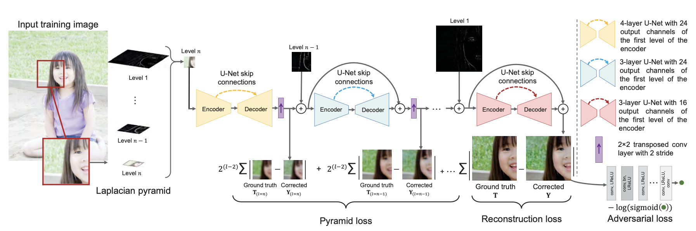
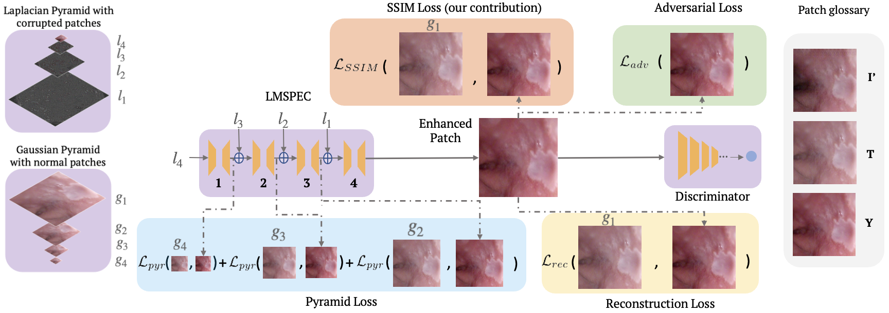
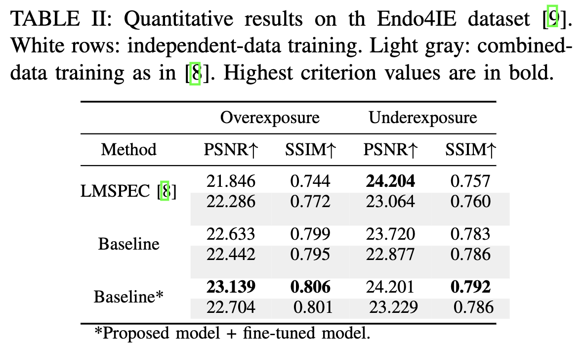
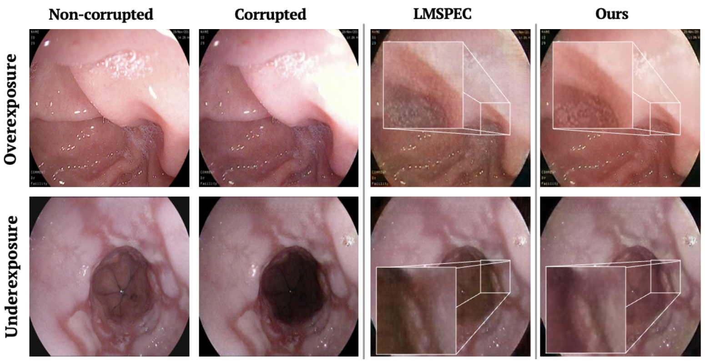

# Learning Multi-Scale Exposure Correction for Endoscopy (Endo-LMSPEC)

# Introduction 

This repository contains the code implemented in our paper "Multi-Scale Structural-aware Exposure Correction
for Endoscopic Imaging" published in the International Symposium on Biomedical Imaging 2023 conference. The 
contribution is an extension to the objective function of "Learning Multi-Scale Photo Exposure Correction (LMSPEC)"
by Afifi et al.), a method originally introduced to enhance images from natural scenes. It is used here fot the 
exposure correction in endoscopic imaging and the preservation of structural information. To the best of our
knowledge, this contribution is the first one that addresses the enhancement of both types of endoscopic artifacts 
(under- and over-exposure) using a deep learning method. Tested on the Endo4IE dataset (download 
[here](https://data.mendeley.com/datasets/3j3tmghw33)) from the paper "A Novel Hybrid Endoscopic Dataset for
Evaluating Machine Learning-based Photometric Image Enhancement Models" by García-Vega et al., the proposed 
implementation has yielded a significant improvement over LMSPEC reaching a SSIM increase of 4.40% and 4.21% for 
over- and under-exposed images, respectively. 

The following figure depicts a diagram from the LMSPEC architecture.

The following figure depicts a diagram of how the three original losses and our proposal, the SSIM loss, are 
computed.

## Results

### Quantitative Results

### Qualitatively Results

## Installation in virtual environment

~~~
# Create a conda env
conda create --name endo_lmspec

# activate the enviroment
conda activate endo_lmspec

# install Pytorch
conda install pytorch torchvision -c pytorch

# You can install the few extra requirements manually or with the following code.
conda install --yes --file requirements.txt
~~~

## Training

### Patches Extraction

Before training the model we must create random patches with different dimensions from both training and validation set.
Therefore, before continue with the extraction of patches we may want to locate our datasets as follows:

~~~
exposure_dataset/
      training/
          exp_images/
          gt_images/
      validation/
          exp_images/
          gt_images/
~~~

The given code in python includes a script called *patches_extraction.py* with two arguments: 1) *exposure_dataset* that
receives the directory that contains both training and validation datasets, and 2) *patches_size_pow* that receives a 
list with the powers of 2 that will express the size of the patches, besides to define the max number of patches (for 
instance, *"7 8"* for 128x128 and 256x256 patches, respectively). Then it will create directories with the patches for 
each patch size from all datasets. For example:

~~~
CUDA_VISIBLE_DEVICES =1 python patches_extraction.py \
                                --exposure_dataset  "/path/to/exposure_dataset/" \
                                --patches_size_pow 7 8
~~~

Since, endoscopic frames are size 512x512, we established by default only extracting 128x128 and 256x256 patches,
however, it can be specified with the argument *--patch_sizes*. In addition, some hyper-parameters could also be
configured with arguments you can find in *main_training.py* script.

Once, the patches are created we can train the network with the following code:

~~~
CUDA_VISIBLE_DEVICES =1 python main_training.py \
                                --exposure_dataset  "/path/to/exposure_dataset/" \
                                --loss_weights [0.25, 0.25, 1.0, 0.25, 0.0]
~~~

>**Note:** This code also contains an extra loss function, the *Histogram Loss* which can be enabled changing the 
last value from the list of loss weights in argument *--loss_weights*. By default, we set the best configuration 
we obtained for the regularization terms $\alpha$, $\beta$, $\delta$= 0.25, $\gamma$ = 1.0, and $\epsilon$ which
corresponds to regularization term for *histo_loss* is set to 0.0.

## Evaluation

The evaluation of the model can be visualized in real-time with the package *wandb* from the platform Weights and 
Biases. You will be able to see the performance of the fourth losses, however, by uncommenting the lines of 
Histo_loss in the experiment logs and train report, you can follow the performance of this loss also.

## Test

For testing on corrupted frames, run 

~~~
CUDA_VISIBLE_DEVICES =1 python test_model.py \
                                --model path/to/model.pth \
                                --input_dir  "/path/to/test/" \
                                --output_dir "/path/to/output_dir/" 
~~~

## Model Weights

In accordance with the quantitative results obtained [Table II](#quantitative-results), our baseline (EndoLMPSEC) plus 
fine-tuning, outperforms from the original LMSPEC and the proposal without hyper-parmeter tuning. In the following table
you can find the links to the weights of each model trained with different splits of the dataset: i) underexposure only
(and tested on underexposure test set), ii) Overexposure only (and tested on overexposure test set), and iii) both 
combined $^{1}$ (and tested in both exposure errors separately). 

|     Model      |                                   Description                                   | ModelWeights |
|:--------------:|:-------------------------------------------------------------------------------:|:------------:|
|    Underexp    |                    Trained with underexp, tested on underexp                    |   [link](https://drive.google.com/file/d/1GS65paskKKghUlRVyIzRupEWX9NZy0QE/view?usp=share_link)   |
|    Overexp     |                     Trained with overexp, tested on overexp                     |   [link](https://drive.google.com/file/d/1O33a7IkP5baaFvI-mj3L_xEDMMdbU30V/view?usp=share_link)   |
| Combined | Trained with both datasets combined $^{1}$, tested on underexp and overexp separately |   [link](https://drive.google.com/file/d/1Rx-SAQBmNw1ACHyxUKnzYiIzTwfm5ah0/view?usp=share_link)   |

>$^{1}$ For reproducing our work, you can download the combined dataset used for training and for validation
> [here](https://drive.google.com/drive/folders/1ULuLG4YQwUKlr-BJnWOPyM5BK35AEF2v?usp=share_link).

## Citation

~~~
@article{garcia2022multi, title={Multi-Scale Structural-aware Exposure Correction for Endoscopic Imaging},
         author={Garcia-Vega, Axel and Espinosa, Ricardo and Ramirez-Guzman, Luis and Bazin, Thomas and Falcon-Morales, Luis and Ochoa-Ruiz, Gilberto and Lamarque, Dominique and Daul, Christian},
         journal={arXiv preprint arXiv:2210.15033},
         year={2022}
}
~~~

## References

1. García-Vega, A., Espinosa, R., Ochoa-Ruiz, G., Bazin, T., Falcón-Morales, L., Lamarque, D., & Daul, C. (2022, 
October). A Novel Hybrid Endoscopic Dataset for Evaluating Machine Learning-Based Photometric Image Enhancement Models. 
In Advances in Computational Intelligence: 21st Mexican International Conference on Artificial Intelligence, 
MICAI 2022, Monterrey, Mexico, October 24–29, 2022, Proceedings, Part I (pp. 267-281). Cham: Springer Nature Switzerland.

2. Afifi, M., Derpanis, K. G., Ommer, B., & Brown, M. S. (2021). Learning multi-scale photo exposure correction. 
In Proceedings of the IEEE/CVF Conference on Computer Vision and Pattern Recognition (pp. 9157-9167).

3. Garcia-Vega, Axel; Ochoa, Gilberto; Espinosa, Ricardo (2022), “Endoscopic real-synthetic over- and underexposed 
frames for image enhancement”, Mendeley Data, V2, doi: 10.17632/3j3tmghw33.2

## Contact

email: Axel García [caaxgave@gmail.com](caaxgave@gmail.com), Ricardo Espinosa [respinosa@up.edu.mx](respinosa@up.edu.mx), 
Gilberto Ochoa [gilberto.ochoa@tec.mx](gilberto.ochoa@tec.mx).